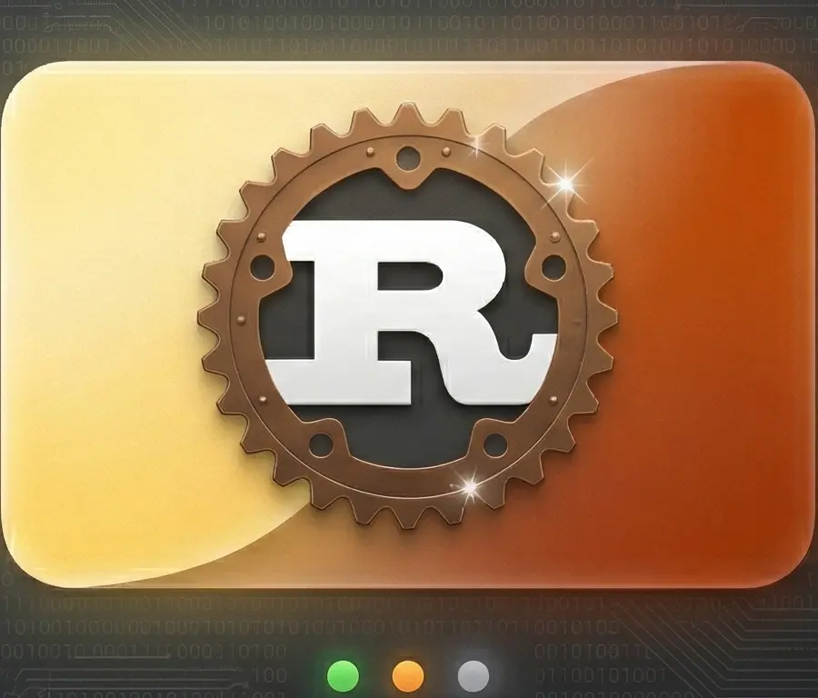
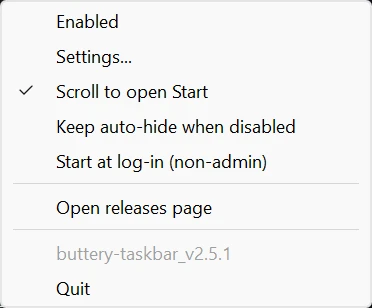

# Buttery Taskbar v2.5.1

English | [简体中文](README.zh-CN.md)

This repository hosts a Rust rewrite of Buttery Taskbar, based on the behavior and feature set of the original Jai implementation.

The legacy Jai source tree is still included locally under `ButteryTaskbar2_jai/`, while the repository root is the actively developed Rust project.

## Project Screenshots





## What This Project Is

Buttery Taskbar hides the Windows taskbar more aggressively than the built-in auto-hide mode. The taskbar stays out of the way until it is actually needed, such as when the Start menu, tray overflow, or other shell UI becomes active.

This Rust version is a reconstruction of the original project, with the goal of preserving the user-facing behavior while removing the dependency on the Jai compiler and making Windows 10/11 support easier to maintain.

## Relationship To The Original Version

- Original upstream project: [LuisThiamNye/ButteryTaskbar2](https://github.com/LuisThiamNye/ButteryTaskbar2)
- Legacy upstream releases: [ButteryTaskbar2 releases](https://github.com/LuisThiamNye/ButteryTaskbar2/releases)
- Legacy local source tree in this repository: `ButteryTaskbar2_jai/`

The Rust port is based on the old version's behavior, including:

- tray-based control flow
- taskbar show/hide control through Win32 APIs
- customizable toggle shortcut (default: `Ctrl` + `Win` + `F11`)
- scroll-at-screen-edge activation
- auto-hide state coordination with Windows
- startup registration in `HKCU\Software\Microsoft\Windows\CurrentVersion\Run`

## Current Rust Implementation

Implemented in the current Rust version:

- hidden Win32 message window
- native tray icon and callback handling
- Win11-safe tray callback handling for context-menu invocation
- native popup tray menu with version display
- taskbar visibility control for primary and secondary taskbars
- Start/menu/taskbar shell-UI visibility heuristics
- keyboard hook for the Windows key tracking
- customizable global hotkey via `RegisterHotKey` API
- mouse hook for screen-edge reveal (2-pixel activation zone) and bottom-edge mouse move detection
- config persistence in `%APPDATA%\Buttery Taskbar\config.json`
- startup toggle through the per-user Run registry key
- icon embedded via `tauri-winres`

Current differences from the old Jai version:

- the old custom-drawn menu UI has been replaced by a native Windows popup menu
- the old GitHub update-check status UI has not yet been reimplemented
- the config format is now JSON instead of the fixed-size Jai binary config block
- the toggle shortcut is now customizable instead of hardcoded

## Project Layout

- `src/`: active Rust implementation
- `assets/`: Rust-side application assets, including the embedded app icon
- `ButteryTaskbar2_jai/`: archived legacy Jai implementation kept for reference and parity work

## Build

Requirements:

- Windows
- Rust toolchain with Cargo (edition 2024)
- MSVC toolchain / Windows SDK

Commands:

```pwsh
cargo build          # debug build
cargo build --release # release build
```

Release binary:

```text
target/release/buttery-taskbar.exe
```

One-click release build with versioned filename:

```pwsh
.\build_release.bat
# produces: target\release\buttery-taskbar_v2.5.1.exe
```

## Configuration

Config file: `%APPDATA%\Buttery Taskbar\config.json`

| Option | Type | Default | Menu Label | Description |
|--------|------|---------|------------|-------------|
| `enabled` | bool | `true` | Enabled | Master switch for taskbar hiding |
| `scroll_activation_enabled` | bool | `true` | Scroll to open Start | Scroll at bottom edge to open Start menu |
| `toggle_shortcut` | object | `Win+Ctrl+F11` | Settings... | Customizable toggle hotkey |
| `auto_launch_enabled` | bool | `false` | Start at log-in (non-admin) | Auto-start at log-in |
| `autohide_when_disabled` | bool | system state | Keep auto-hide when disabled | Keep Windows auto-hide when Buttery is disabled |

### Option Details

#### Enabled

Master switch. When enabled, Buttery aggressively hides the taskbar. The taskbar only appears when needed (Win key, Start menu, tray overflow, etc.). When disabled, the taskbar returns to its default Windows behavior.

#### Scroll to open Start

Controls whether scrolling the mouse wheel at the bottom edge of the screen opens the Start menu.

| Scroll to open Start | Mouse touch bottom edge | Scroll at bottom edge |
|---------------------|------------------------|----------------------|
| ☑ Checked | Taskbar appears (more reliable via hook + Windows auto-hide) | Start menu opens |
| ☐ Unchecked | Taskbar appears (Windows auto-hide only, may be less reliable) | No special effect |

**Note**: Mouse touch at the bottom edge always reveals the taskbar when Enabled is checked. This is a side effect of `ABS_AUTOHIDE`, which is required for reliable taskbar hiding. When this option is checked, the mouse hook also improves the reliability of bottom-edge taskbar reveal.

#### Keep auto-hide when disabled

Only takes effect when Buttery is **disabled** (Enabled is unchecked):

| Keep auto-hide | Behavior when Buttery is disabled |
|----------------|----------------------------------|
| ☑ Checked | Taskbar stays in Windows native auto-hide mode (still hides automatically) |
| ☐ Unchecked | Taskbar is always visible (restores Windows default) |

### Behavior Matrix

| Enabled | Scroll to open Start | Keep auto-hide | Mouse bottom edge | Scroll at bottom | Win key / Shell UI |
|---------|---------------------|---------------|-------------------|-----------------|-------------------|
| ✅ | ✅ | any | ✅ Shows | ✅ Start menu opens | ✅ |
| ✅ | ❌ | any | ✅ Shows | ❌ No effect | ✅ |
| ❌ | any | ✅ | ✅ (Windows native) | ❌ | ✅ |
| ❌ | any | ❌ | ❌ (always visible) | ❌ | ✅ |

## Runtime Behavior

- the taskbar is visible while the Windows key is held
- the taskbar is visible while shell UI such as Start or tray overflow is foregrounded
- the tray menu is opened from the notification icon and is positioned above the taskbar edge
- when Enabled, mouse touching the bottom screen edge always shows the taskbar (Windows auto-hide behavior)
- when Scroll to open Start is on, scrolling at the bottom edge opens the Start menu
- when Scroll to open Start is off, scrolling at the bottom edge has no special effect
- when disabled, the app can optionally keep Windows auto-hide enabled

## Legacy Reference

If you need the old implementation for comparison, debugging, or migration work:

- local legacy README: `ButteryTaskbar2_jai/README.md`
- local legacy sources: `ButteryTaskbar2_jai/`
- original upstream repository: [LuisThiamNye/ButteryTaskbar2](https://github.com/LuisThiamNye/ButteryTaskbar2)
